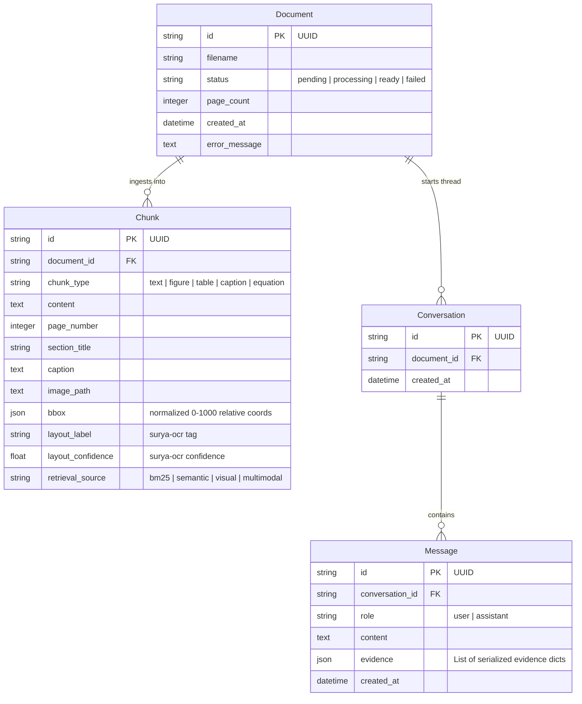

# 🧠 Neural Machine Reading with Visual Grounding for Document Understanding

A state-of-the-art **Multimodal Document Intelligence** and **Hybrid RAG** (Retrieval-Augmented Generation) system built to parse, index, search, and visually ground answers for complex native and scanned PDF documents. 

This enterprise-grade workspace combines deep layout-aware analysis, advanced OCR, multi-stage hybrid search (dense semantic, sparse lexical, and cross-modal visual), and the reasoning capabilities of **Google Gemini** to deliver precise natural language responses complete with bounding-box highlights and on-demand visual citations.

---

## 🏗️ System Architecture & Data Flow

This application is decoupled into a high-performance **FastAPI Backend** and a modern **Next.js Frontend**. The diagram below traces the complete lifecycle of a document from intake to multimodal conversation:

```
                               ┌───────────────────────────┐
                               │    Next.js UI (React)     │
                               │   Port 3000 | Tailwind    │
                               └─────────────┬─────────────┘
                                             ▲ (Real-Time Ingestion Progress,
                                             │  Chat Requests & Figure Overlays)
                                             ▼
                               ┌───────────────────────────┐
                               │   FastAPI Backend Engine  │
                               │        Port 8000          │
                               └───────┬───────────┬───────┘
                                       │           │
     ┌─────────────────────────────────▼┐         ┌▼────────────────────────────────┐
     │      Ingestion Pipeline          │         │    Multi-Stage Hybrid Search    │
     │ 1. PyMuPDF Page Rasterizer       │         │ 1. BM25 Lexical Keyword Search  │
     │ 2. surya AI Layout Segmentation  │         │ 2. FAISS Dense Semantic Search  │
     │ 3. OpenCV OCR Preprocessing      │         │ 3. CLIP Cross-Modal Visual      │
     │ 4. Tesseract & EasyOCR Engine    │         │ 4. LayoutLMv3 Multimodal Index  │
     │ 5. Lazy-Crop Coordinate Mapping  │         │ 5. Min-Max Score Fusion         │
     └──────────────────────────────────┘         └─────────────────────────────────┘
                                       │           │
                                       └─────┬─────┘
                                             │ (Fused Context + Visual Crops + History)
                                             ▼
                               ┌───────────────────────────┐
                               │      Google Gemini        │
                               │   (gemini-2.5-flash)      │
                               └───────────────────────────┘
```

### 1. Document Ingestion Pipeline
1. **PyMuPDF Rasterizer**: PDF uploads are saved to local storage, and pages are rendered into high-resolution PNGs at $2\times$ zoom using PyMuPDF's C-based rendering. **No system-level Poppler binaries are required**, facilitating lightweight cross-platform installation.
2. **AI Layout Segmentation**: The `surya-ocr` engine partitions rendered pages into semantic elements: *Title, Section-header, Text, List-item, Figure, Table, Caption, Formula, and Footnote*.
3. **OpenCV OCR Enhancement**: For pages containing scanned content, an image preprocessing pipeline (grayscale, adaptive Gaussian thresholding, deskewing, and noise removal) prepares page regions.
4. **Tesseract / EasyOCR**: Text is extracted from raw image areas using Tesseract OCR, with a fallback to EasyOCR.
5. **Unified Coordinate Normalization**: Coordinates are projected onto a standard $0\text{--}1000$ coordinate canvas relative to the page's bounding boundaries.

### 2. Multi-Stage Hybrid Retrieval
When a user submits a chat query, the system extracts relevant context using a five-stage retrieval and fusion process:
1. **BM25 Lexical Search**: Normalizes and indexes text contents. Perfect for matching exact keywords, codes, proper nouns, and short abbreviations.
2. **FAISS Dense Semantic Search**: Embeds chunks using `SentenceTransformers` (`all-MiniLM-L6-v2`) and matches them using cosine similarity. Ideal for concept-level and paraphrased queries.
3. **OpenAI CLIP Cross-Modal Search**: Generates multi-modal embeddings for crop figures and tables using `CLIP-ViT-B-32`. Queries are converted directly into visual vector searches, retrieving visual assets even if their surrounding text is sparse.
4. **LayoutLMv3 (Optional)**: Jointly encodes token semantics, visual patches, and spatial bounding coordinates into a 768-dimensional space.
5. **Weighted Score Fusion**: Combines scores using customizable pipeline weights:
   $$\text{Score} = w_{\text{bm25}} \cdot S_{\text{bm25}} + w_{\text{faiss}} \cdot S_{\text{faiss}} + w_{\text{clip}} \cdot S_{\text{clip}}$$

### 3. Generative Grounding & Citation
The retrieved chunks, along with conversation history, visual crops of relevant figures, and bounding-box coordinates, are bundled into a rich prompt payload. The **Google Gemini API** evaluates this context and generates an answer. The backend extracts coordinates, maps them back to the source document, and displays them as interactive visual citations in the frontend.

---

## 📂 Project Directory Structure

```
edi_project/
├── backend/                  # FastAPI Application Engine
│   ├── api/                  # REST API Route Modules
│   │   ├── documents.py      # Chunk views, deletions, layout and figure crops
│   │   ├── ingest.py         # PDF uploading, background workers, progress status
│   │   └── query.py          # Grounded chat questions, thread history, conversations
│   ├── layout/               # AI Layout Detection Engine
│   │   └── layout_engine.py  # surya-ocr wrapper and region classifier
│   ├── models/               # SQLAlchemy relational schemas & pydantic types
│   │   ├── db_models.py      # SQLite relational database schemas & migrations
│   │   └── schemas.py        # API schemas and validation models
│   ├── multimodal/           # Advanced Deep Document Transformers
│   │   └── layoutlm_engine.py# LayoutLMv3 joint spatial-visual-text encoder
│   ├── ocr/                  # Optical Character Recognition Engine
│   │   └── ocr_engine.py     # OpenCV preprocessing, Tesseract & EasyOCR integration
│   ├── rag/                  # Multi-Stage Search & Core Retrieval
│   │   └── retriever.py      # BM25, FAISS, CLIP & LayoutLM weighted fusion retriever
│   ├── services/             # Core Backend Services
│   │   └── pdf_service.py    # PyMuPDF parser, page renderer, dynamic cropper
│   ├── utils/                # System Utilities
│   │   └── logger.py         # Standardized server logger
│   ├── vector_db/            # High-Speed Vector Databases
│   │   └── faiss_db.py       # FAISS local vector indices manager
│   ├── vision/               # Cross-Modal Models
│   │   └── clip_engine.py    # OpenAI CLIP image/text encoder
│   ├── config.py             # BaseSettings, dynamic paths and pipeline overrides
│   ├── main.py               # Application entrypoint, lifecycle, and health routes
│   └── requirements.txt      # Python dependencies manifest
│
├── frontend/                 # Next.js Web Client Workspace
│   ├── src/
│   │   ├── app/              # Next.js App Router Structure
│   │   │   ├── globals.css   # Tailwinds and customized design-system tokens
│   │   │   ├── layout.tsx    # Workspace page wrapper
│   │   │   └── page.tsx      # Core Dashboard workspace assembly
│   │   ├── components/       # Premium UI React Components
│   │   │   ├── AnswerPane.tsx# Grounded answers and response wrappers
│   │   │   ├── ChatPanel.tsx # Interactive typewriter chat interface
│   │   │   ├── DocumentList.py# Ingested documents manager & status indicators
│   │   │   ├── ErrorAlert.tsx# Clean visual error message banner
│   │   │   ├── EvidencePane.tsx# High-precision page canvas overlays & lazy crops
│   │   │   ├── LoadingSpinner.tsx# Minimal interface progress loaders
│   │   │   ├── PagePreview.tsx# PDF Page container & visual citations boundaries
│   │   │   └── UploadPanel.tsx# Drag-and-drop ingestion panel with progress bars
│   │   ├── lib/              # Frontend Utilities
│   │   │   └── api.ts        # Axios instances, request logger, error interceptors
│   │   └── types/            # TypeScript Interface Definitions
│   │       └── index.ts      # Workspace typing definitions
│   ├── tailwind.config.js    # Glassmorphism & Tailwinds layout rules
│   ├── package.json          # Node dependency configurations
│   └── tsconfig.json         # TypeScript compiler rules
│
├── storage/                  # Persistent Filesystem Assets (Auto-created)
│   ├── uploads/              # Saved raw source PDF files
│   ├── pages/                # Rendered full page PNG raster images
│   ├── figures/              # Dynamic on-demand figure/table crop images
│   └── vector_indices/       # Serialized FAISS vector and BM25 indices
└── README.md                 # Project workspace documentation
```

---

## 🗄️ Relational Database Schema

The relational layer is managed by SQLite via **SQLAlchemy ORM** (`backend/models/db_models.py`). It contains lightweight on-the-fly migrations to upgrade schema tables seamlessly without requiring external tools like Alembic.



---

## 🔌 API Endpoints Specification

FastAPI exposes an interactive documentation dashboard at `http://localhost:8000/docs`.

### 1. Ingestion Routes (`api/ingest.py`)
* **`POST /api/ingest/upload`**: Takes a PDF or image file, assigns a unique UUID, writes it to disk, and runs the background processing pipeline thread.
* **`GET /api/ingest/status/{document_id}`**: Retrieves document ingestion progress.

### 2. Document Views Routes (`api/documents.py`)
* **`GET /api/documents`**: Lists all metadata records of uploaded files.
* **`GET /api/documents/{id}`**: Fetches a single document's information.
* **`GET /api/documents/{id}/chunks`**: Lists raw document content chunks (supports filtering by `chunk_type` and `page`).
* **`GET /api/documents/{id}/layout`**: Returns all AI layout structures and bounding boxes.
* **`GET /api/documents/{id}/figure/{chunk_id}`**: Dynamic cropper endpoint. Parses relative coordinates, crops the region from the page image, applies boundary padding, and serves the cropped image binary.
* **`DELETE /api/documents/{id}`**: Deletes SQLite records, local vector indices, uploads, and cached page images.

### 3. Query & Chat Routes (`api/query.py`)
* **`POST /api/query/ask`**: Executes hybrid retrieval, models the prompt, calls Gemini, registers user and assistant dialogue exchanges, and saves conversation threads.
* **`GET /api/query/conversations/{conversation_id}`**: Fetches chat logs of a specific thread.
* **`GET /api/query/documents/{document_id}/conversations`**: Lists all threads for a specific document.
* **`GET /api/query/documents/{document_id}/latest-conversation`**: Resolves active thread details.

---

## 🛠️ Complete Setup & Launch Instructions

### Prerequisites
1. **Python 3.10+**: Ensure Python is added to your Windows PATH.
2. **Node.js 18+ & npm**: Required for running the Next.js React client.
3. **Tesseract OCR (Optional)**: Download and run the Windows installer from [UB Mannheim Tesseract](https://github.com/UB-Mannheim/tesseract/wiki). Add `C:\Program Files\Tesseract-OCR` to your System Environment variables.

---

### Step 1: Clone and Environment Variables Setup
1. Inside the root folder, copy the example environment file for the backend:
   ```powershell
   # Copy template
   Copy-Item .env.example backend/.env
   ```
2. Open `backend/.env` and paste your Gemini API key:
   ```env
   GEMINI_API_KEY=your_actual_gemini_api_key
   ```
3. Copy the frontend environment file:
   ```powershell
   Copy-Item frontend/.env.example frontend/.env
   ```
   *(Ensure it contains `NEXT_PUBLIC_API_URL=http://localhost:8000/api`)*

---

### Step 2: Launch the Python FastAPI Backend
1. Open a terminal and navigate to the `backend/` folder:
   ```powershell
   cd backend
   ```
2. Create and activate a Python virtual environment:
   ```powershell
   python -m venv .venv
   .venv\Scripts\Activate.ps1
   ```
3. Install the backend requirements:
   ```powershell
   pip install -r requirements.txt
   ```
4. Start the development server:
   ```powershell
   python main.py
   ```
   The backend will launch on **`http://localhost:8000`**. You can verify that it is online and healthy by visiting the diagnostics route at `http://localhost:8000/health`.

---

### Step 3: Launch the Next.js Frontend
1. Open a new terminal window and navigate to the `frontend/` folder:
   ```powershell
   cd frontend
   ```
2. Install the frontend dependencies:
   ```powershell
   npm install
   ```
3. Start the Next.js development server:
   ```powershell
   npm run dev
   ```
   The web application will launch on **`http://localhost:3000`**. Open your browser and navigate to the address to begin exploring and interacting with your documents.

---

## ⚙️ Advanced Pipeline Configurations

System defaults are controlled via the `backend/config.py` module and can be overridden by adding the keys below to `backend/.env`:

```env
# Relational DB
DATABASE_URL=sqlite:///./research_rag.db

# OCR Preprocessing
ENABLE_OCR_PREPROCESSING=true
PREFER_EASYOCR=true

# AI Layout Segmentation
ENABLE_LAYOUT_DETECTION=true

# Multi-Stage Search Engines
ENABLE_CLIP=true
ENABLE_HYBRID_RETRIEVAL=true

# Hybrid Weights (Must sum to 1.0)
BM25_WEIGHT=0.30
FAISS_WEIGHT=0.50
CLIP_WEIGHT=0.20

# Optional LayoutLMv3 Model (Loads ~900MB HuggingFace transformer)
ENABLE_LAYOUTLM=false
```

---

## 🛡️ Production & Deployment Ready
* **Render.com Compatibility**: Designed for cloud architectures with robust backend path resolution, health diagnostic checkers, and on-demand file system tests.
* **Vercel / Next.js ready**: Configured for static site generation, responsive page preview scales, and error boundary interceptors.
* **Docker Containerization ready**: Uses standard env lookups for ports (`PORT=8000`) and customizable storage directory mounts.
